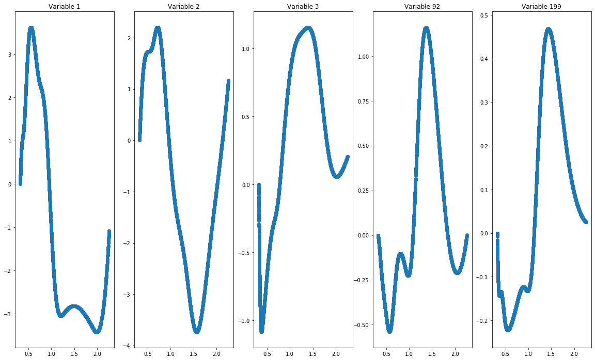
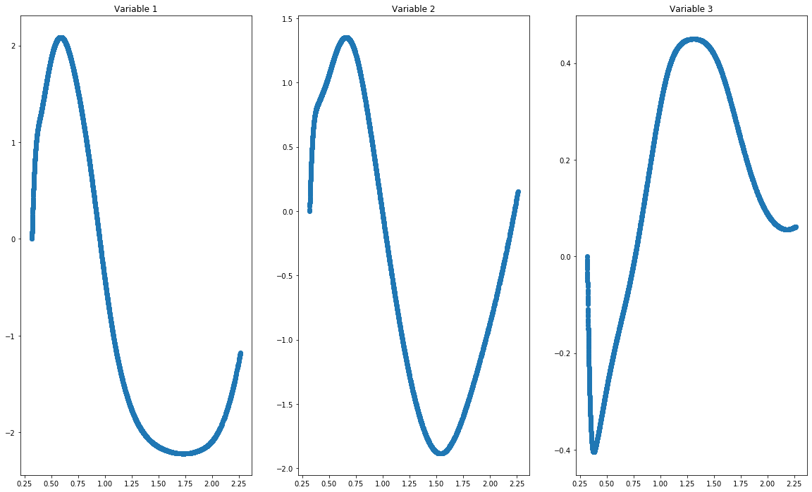

# How to use the GAM class


```python
from GAM_torch import GAM
import torch
from sklearn.model_selection import train_test_split
from utils import compute_nonzeros, add_intercept
import numpy as np
import matplotlib.pyplot as plt
import os
os.environ['FOR_DISABLE_CONSOLE_CTRL_HANDLER'] = '1'
torch.set_printoptions(sci_mode=False)
```


```python
# Define non-parametric functions for simulation

def f1(x: torch.Tensor):
    return -5 * torch.sin(3 * x)

def f2(x: torch.Tensor):
    return -(2 * (1 - x ** 2) * np.exp(3 * x) - 2)

def f3(x: torch.Tensor):
    return -(-4 * x ** 4 + 9.33 * x ** 3 + 5 * x ** 2 - 8.33 * x)
```


```python
# function to generate simulated data
def generate_data(n: int, p: int, data_class: str, fs: list, seed: int, lb: float, ub: float, cor: float = 0):
    """generate data"""
    torch.manual_seed(seed)
    t = np.sqrt(cor / (1 - cor))
    if lb > ub:
        lb, ub = ub, lb
    rg = ub - lb
    shift = 0.5 - (ub + lb) / 2 / rg
    x = (torch.rand([n, p]) - shift) * rg
    u = (torch.rand([n, 1]) - shift) * rg
    #x = torch.where(torch.abs(x) > 1, torch.sign(x), x)
    x = (x + t * u) / np.sqrt(1 + t ** 2)
    eta = None
    for i in range(len(fs)):
        if eta is None:
            eta = fs[i](x[:, i])
        else:
            eta += fs[i](x[:, i])
    if data_class == 'regression':
        y = eta + torch.randn([n])
    elif data_class == 'classification':
        eta = torch.exp(eta) / (1 + torch.exp(eta))
        y = torch.bernoulli(eta)
    elif data_class == 'poisson':
        eta = torch.exp(eta)
        y = torch.poisson(eta)
    elif data_class == 'gamma':
        eta = torch.exp(-eta)
        y = torch.distributions.gamma.Gamma(eta, 1).sample()
    return x, y

```


```python
degree = 3
df = 9
data_class = 'classification'
n = 100
p = 200
```


```python
# generate train, test data. Spline is not stable outside of edge knots, here for demonstration purposes, we generate testing
# data within the range of training  data. In practice, it's ok to temporarily extend edge knots when data are out of range.
fs = [f1, f2, f3]
seed = 666
x_train, y_train = generate_data(n, p, data_class, fs, seed, -1, 1, cor=0)
lb, ub = max(x_train.numpy().min(axis=0)), min(x_train.numpy().max(axis=0))
x_test, y_test = generate_data(5000, p, data_class, fs, seed, lb, ub, cor=0)
```


```python
# fit_2 fits the two-step approach, now we look at the case when there is no smoothness penalty
model = GAM(tol=1e-2, df=df, data_class=data_class, degree=degree)
result1 = model.fit_2(x_train, y_train, num_lams=50, smooth=0.0)
y_predict = model.predict(x_test)
```

    Fitted lam = 0.040956515818834305, 0 nonzero variables [0]
    Fitted lam = 0.040120668557225445, 0 nonzero variables [0]
    Fitted lam = 0.03928482129561658, 0 nonzero variables [0]
    Fitted lam = 0.03844897403400772, 0 nonzero variables [0]
    Fitted lam = 0.03761312677239885, 0 nonzero variables [0]
    Fitted lam = 0.03677727951078999, 0 nonzero variables [0]
    Fitted lam = 0.03594143224918112, 0 nonzero variables [0]
    Fitted lam = 0.03510558498757226, 0 nonzero variables [0]
    Fitted lam = 0.0342697377259634, 0 nonzero variables [0]
    Fitted lam = 0.033433890464354535, 1 nonzero variables [0, 1]
    Fitted lam = 0.032598043202745675, 1 nonzero variables [0, 1]

    C:\Users\kaixu\Dropbox\research\PenalizedGAM\utils.py:42: UserWarning: Looks like intercept is already included, nothing has been added.
      warn("Looks like intercept is already included, nothing has been added.")
    

    
    Fitted lam = 0.03176219594113681, 1 nonzero variables [0, 1]
    Fitted lam = 0.030926348679527947, 1 nonzero variables [0, 1]
    Fitted lam = 0.030090501417919083, 1 nonzero variables [0, 1]
    Fitted lam = 0.02925465415631022, 1 nonzero variables [0, 1]
    Fitted lam = 0.028418806894701356, 1 nonzero variables [0, 1]
    Fitted lam = 0.027582959633092492, 1 nonzero variables [0, 1]
    Fitted lam = 0.02674711237148363, 1 nonzero variables [0, 1]
    Fitted lam = 0.025911265109874765, 1 nonzero variables [0, 1]
    Fitted lam = 0.0250754178482659, 2 nonzero variables [0, 1, 2]
    Fitted lam = 0.024239570586657037, 2 nonzero variables [0, 1, 2]
    Fitted lam = 0.023403723325048174, 2 nonzero variables [0, 1, 2]
    Fitted lam = 0.02256787606343931, 2 nonzero variables [0, 1, 2]
    Fitted lam = 0.02173202880183045, 2 nonzero variables [0, 1, 2]
    Fitted lam = 0.020896181540221586, 2 nonzero variables [0, 1, 2]
    Fitted lam = 0.020060334278612722, 2 nonzero variables [0, 1, 2]
    Fitted lam = 0.01922448701700386, 2 nonzero variables [0, 1, 2]
    Fitted lam = 0.018388639755394995, 2 nonzero variables [0, 1, 2]
    Fitted lam = 0.01755279249378613, 2 nonzero variables [0, 1, 2]
    Fitted lam = 0.016716945232177267, 2 nonzero variables [0, 1, 2]
    Fitted lam = 0.015881097970568404, 2 nonzero variables [0, 1, 2]
    Fitted lam = 0.015045250708959542, 2 nonzero variables [0, 1, 2]
    Fitted lam = 0.014209403447350678, 3 nonzero variables [0, 1, 2, 3]
    Fitted lam = 0.013373556185741814, 3 nonzero variables [0, 1, 2, 3]
    Fitted lam = 0.01253770892413295, 3 nonzero variables [0, 1, 2, 3]
    Fitted lam = 0.011701861662524087, 5 nonzero variables [0, 1, 2, 3, 92, 139]
    Fitted lam = 0.010866014400915225, 6 nonzero variables [0, 1, 2, 3, 92, 139, 199]
    Fitted lam = 0.010030167139306361, 8 nonzero variables [0, 1, 2, 3, 42, 92, 99, 139, 199]
    Fitted lam = 0.009194319877697497, 8 nonzero variables [0, 1, 2, 3, 42, 92, 99, 139, 199]
    Fitted lam = 0.008358472616088634, 11 nonzero variables [0, 1, 2, 3, 42, 86, 87, 92, 99, 115, 139, 199]
    Fitted lam = 0.007522625354479771, 12 nonzero variables [0, 1, 2, 3, 32, 42, 86, 87, 92, 99, 115, 139, 199]
    Fitted lam = 0.006686778092870907, 13 nonzero variables [0, 1, 2, 3, 32, 42, 86, 87, 92, 99, 115, 139, 143, 199]
    Fitted lam = 0.005850930831262043, 15 nonzero variables [0, 1, 2, 3, 32, 42, 86, 87, 92, 99, 115, 125, 139, 143, 197, 199]
    Fitted lam = 0.005015083569653181, 17 nonzero variables [0, 1, 2, 3, 32, 42, 85, 86, 87, 92, 99, 115, 125, 139, 143, 162, 197, 199]
    Fitted lam = 0.004179236308044317, 19 nonzero variables [0, 1, 2, 3, 32, 42, 61, 85, 86, 87, 92, 99, 115, 125, 137, 139, 143, 162, 197, 199]
    Fitted lam = 0.0033433890464354536, 22 nonzero variables [0, 1, 2, 3, 16, 32, 42, 61, 85, 86, 87, 92, 99, 115, 125, 137, 139, 143, 162, 173, 188, 197, 199]
    Fitted lam = 0.0025075417848265903, 27 nonzero variables [0, 1, 2, 3, 16, 29, 32, 33, 42, 61, 70, 85, 86, 87, 92, 99, 115, 125, 126, 137, 139, 143, 162, 173, 180, 188, 197, 199]
    Fitted lam = 0.22490791976451874, 0 nonzero variables [0]
    Fitted lam = 0.22031796221830408, 0 nonzero variables [0]
    Fitted lam = 0.2157280046720894, 0 nonzero variables [0]
    Fitted lam = 0.21113804712587475, 0 nonzero variables [0]
    Fitted lam = 0.2065480895796601, 0 nonzero variables [0]
    Fitted lam = 0.20195813203344543, 0 nonzero variables [0]
    Fitted lam = 0.19736817448723074, 0 nonzero variables [0]
    Fitted lam = 0.19277821694101607, 0 nonzero variables [0]
    Fitted lam = 0.1881882593948014, 0 nonzero variables [0]
    Fitted lam = 0.18359830184858675, 1 nonzero variables [0, 1]
    Fitted lam = 0.17900834430237209, 1 nonzero variables [0, 1]
    Fitted lam = 0.1744183867561574, 1 nonzero variables [0, 1]
    Fitted lam = 0.16982842920994273, 1 nonzero variables [0, 1]
    Fitted lam = 0.16523847166372807, 1 nonzero variables [0, 1]
    Fitted lam = 0.1606485141175134, 1 nonzero variables [0, 1]
    Fitted lam = 0.15605855657129872, 1 nonzero variables [0, 1]
    Fitted lam = 0.15146859902508406, 1 nonzero variables [0, 1]
    Fitted lam = 0.1468786414788694, 1 nonzero variables [0, 1]
    Fitted lam = 0.14228868393265473, 1 nonzero variables [0, 1]
    Fitted lam = 0.13769872638644007, 1 nonzero variables [0, 1]
    Fitted lam = 0.13310876884022538, 1 nonzero variables [0, 1]
    Fitted lam = 0.12851881129401072, 1 nonzero variables [0, 1]
    Fitted lam = 0.12392885374779605, 1 nonzero variables [0, 1]
    Fitted lam = 0.11933889620158138, 1 nonzero variables [0, 1]
    Fitted lam = 0.11474893865536671, 1 nonzero variables [0, 1]
    Fitted lam = 0.11015898110915204, 1 nonzero variables [0, 1]
    Fitted lam = 0.10556902356293738, 1 nonzero variables [0, 1]
    Fitted lam = 0.10097906601672271, 1 nonzero variables [0, 1]
    Fitted lam = 0.09638910847050804, 1 nonzero variables [0, 1]
    Fitted lam = 0.09179915092429337, 2 nonzero variables [0, 1, 2]
    Fitted lam = 0.0872091933780787, 2 nonzero variables [0, 1, 2]
    Fitted lam = 0.08261923583186404, 2 nonzero variables [0, 1, 2]
    Fitted lam = 0.07802927828564936, 2 nonzero variables [0, 1, 2]
    Fitted lam = 0.0734393207394347, 2 nonzero variables [0, 1, 2]
    Fitted lam = 0.06884936319322003, 2 nonzero variables [0, 1, 2]
    Fitted lam = 0.06425940564700536, 2 nonzero variables [0, 1, 2]
    Fitted lam = 0.05966944810079069, 2 nonzero variables [0, 1, 2]
    Fitted lam = 0.05507949055457602, 2 nonzero variables [0, 1, 2]
    Fitted lam = 0.050489533008361356, 2 nonzero variables [0, 1, 2]
    Fitted lam = 0.04589957546214669, 2 nonzero variables [0, 1, 2]
    Fitted lam = 0.04130961791593202, 2 nonzero variables [0, 1, 2]
    Fitted lam = 0.03671966036971735, 2 nonzero variables [0, 1, 2]
    Fitted lam = 0.03212970282350268, 2 nonzero variables [0, 1, 2]
    Fitted lam = 0.02753974527728801, 2 nonzero variables [0, 1, 2]
    Fitted lam = 0.022949787731073343, 2 nonzero variables [0, 1, 2]
    Fitted lam = 0.018359830184858674, 3 nonzero variables [0, 1, 2, 3]
    Fitted lam = 0.013769872638644005, 3 nonzero variables [0, 1, 2, 3]
    Fitted lam = 0.009179915092429337, 6 nonzero variables [0, 1, 2, 3, 42, 92, 199]
    Fitted lam = 0.0045899575462146685, 7 nonzero variables [0, 1, 2, 3, 42, 92, 99, 199]
    lam:0.22490791976451874, gic:1.426938382902876
    lam:0.22031796221830408, gic:1.4269382636935863
    lam:0.2157280046720894, gic:1.4269382636935863
    lam:0.21113804712587475, gic:1.4269382636935863
    lam:0.2065480895796601, gic:1.4269382636935863
    lam:0.20195813203344543, gic:1.4269382636935863
    lam:0.19736817448723074, gic:1.4269382636935863
    lam:0.19277821694101607, gic:1.4269382636935863
    lam:0.1881882593948014, gic:1.4269382636935863
    lam:0.18359830184858675, gic:1.4962825141730614
    lam:0.17900834430237209, gic:1.4760058484855003
    lam:0.1744183867561574, gic:1.4573377929511375
    lam:0.16982842920994273, gic:1.4384584985556907
    lam:0.16523847166372807, gic:1.419655617314846
    lam:0.1606485141175134, gic:1.4011200033011741
    lam:0.15605855657129872, gic:1.3842255435767479
    lam:0.15146859902508406, gic:1.366286452847988
    lam:0.1468786414788694, gic:1.350015815335781
    lam:0.14228868393265473, gic:1.3327854238334007
    lam:0.13769872638644007, gic:1.3171626888099022
    lam:0.13310876884022538, gic:1.3007098995032615
    lam:0.12851881129401072, gic:1.2857474647345848
    lam:0.12392885374779605, gic:1.2700826488318748
    lam:0.11933889620158138, gic:1.2557664476218529
    lam:0.11474893865536671, gic:1.2418354116263695
    lam:0.11015898110915204, gic:1.2272379957022972
    lam:0.10556902356293738, gic:1.2139677367987938
    lam:0.10097906601672271, gic:1.200141604978115
    lam:0.09638910847050804, gic:1.1875467859092064
    lam:0.09179915092429337, gic:1.2453277353022554
    lam:0.0872091933780787, gic:1.2140907291148164
    lam:0.08261923583186404, gic:1.1828701142046907
    lam:0.07802927828564936, gic:1.1522443536494233
    lam:0.0734393207394347, gic:1.122841680404947
    lam:0.06884936319322003, gic:1.0933143738482454
    lam:0.06425940564700536, gic:1.064276838657663
    lam:0.05966944810079069, gic:1.0357492212031343
    lam:0.05507949055457602, gic:1.007073366997049
    lam:0.050489533008361356, gic:0.9794491771433809
    lam:0.04589957546214669, gic:0.9517309311602571
    lam:0.04130961791593202, gic:0.924006665108011
    lam:0.03671966036971735, gic:0.896881842968271
    lam:0.03212970282350268, gic:0.869952881691263
    lam:0.02753974527728801, gic:0.8434651139948823
    lam:0.022949787731073343, gic:0.8173959497187593
    lam:0.018359830184858674, gic:0.85132902113253
    lam:0.013769872638644005, gic:0.789132736599983
    lam:0.009179915092429337, gic:0.9411060679296126
    lam:0.0045899575462146685, gic:0.8353863209019923
    The best lam 0.013769872638644005 and the best gic 0.789132736599983. Finally selected 3 nonzeros: [0, 1, 2, 3]
    


```python
print(f"The testing accuracy is {1 - torch.mean(torch.abs(y_predict.squeeze() - y_test.squeeze()))}")

```

    The testing accuracy is 0.8392000198364258
    


```python
# plot solution path
model.plot_solution_path()
```


```python
# plot estimated functions
model.plot_functions(x_test)
```





```python
# fit_2 fits the two-step approach, add smoothness penalty
model = GAM(tol=1e-2, df=df, data_class=data_class, degree=degree)
result1 = model.fit_2(x_train, y_train, num_lams=50, smooth=0.05)
y_predict = model.predict(x_test)
```

    Fitted lam = 0.032178379595279694, 0 nonzero variables [0]
    Fitted lam = 0.03152167797088623, 0 nonzero variables [0]
    Fitted lam = 0.030864976346492767, 0 nonzero variables [0]
    Fitted lam = 0.030208274722099304, 0 nonzero variables [0]
    Fitted lam = 0.02955157309770584, 0 nonzero variables [0]
    Fitted lam = 0.028894871473312378, 0 nonzero variables [0]
    Fitted lam = 0.028238169848918915, 0 nonzero variables [0]
    Fitted lam = 0.02758146822452545, 0 nonzero variables [0]
    Fitted lam = 0.02692476660013199, 0 nonzero variables [0]
    Fitted lam = 0.026268064975738525, 1 nonzero variables [0, 1]
    Fitted lam = 0.025611363351345062, 1 nonzero variables [0, 1]
    

    C:\Users\kaixu\Dropbox\research\PenalizedGAM\utils.py:42: UserWarning: Looks like intercept is already included, nothing has been added.
      warn("Looks like intercept is already included, nothing has been added.")
    

    Fitted lam = 0.0249546617269516, 1 nonzero variables [0, 1]
    Fitted lam = 0.024297960102558136, 1 nonzero variables [0, 1]
    Fitted lam = 0.023641258478164673, 1 nonzero variables [0, 1]
    Fitted lam = 0.02298455685377121, 1 nonzero variables [0, 1]
    Fitted lam = 0.022327855229377747, 1 nonzero variables [0, 1]
    Fitted lam = 0.021671153604984283, 1 nonzero variables [0, 1]
    Fitted lam = 0.02101445198059082, 1 nonzero variables [0, 1]
    Fitted lam = 0.020357750356197357, 1 nonzero variables [0, 1]
    Fitted lam = 0.019701048731803894, 2 nonzero variables [0, 1, 2]
    Fitted lam = 0.01904434710741043, 2 nonzero variables [0, 1, 2]
    Fitted lam = 0.018387645483016968, 2 nonzero variables [0, 1, 2]
    Fitted lam = 0.017730943858623505, 2 nonzero variables [0, 1, 2]
    Fitted lam = 0.01707424223423004, 2 nonzero variables [0, 1, 2]
    Fitted lam = 0.01641754060983658, 2 nonzero variables [0, 1, 2]
    Fitted lam = 0.015760838985443115, 2 nonzero variables [0, 1, 2]
    Fitted lam = 0.015104137361049652, 2 nonzero variables [0, 1, 2]
    Fitted lam = 0.014447435736656189, 2 nonzero variables [0, 1, 2]
    Fitted lam = 0.013790734112262726, 2 nonzero variables [0, 1, 2]
    Fitted lam = 0.013134032487869263, 2 nonzero variables [0, 1, 2]
    Fitted lam = 0.0124773308634758, 2 nonzero variables [0, 1, 2]
    Fitted lam = 0.011820629239082336, 2 nonzero variables [0, 1, 2]
    Fitted lam = 0.011163927614688873, 4 nonzero variables [0, 1, 2, 3, 139]
    Fitted lam = 0.01050722599029541, 5 nonzero variables [0, 1, 2, 3, 139, 199]
    Fitted lam = 0.009850524365901947, 7 nonzero variables [0, 1, 2, 3, 92, 99, 139, 199]
    Fitted lam = 0.009193822741508484, 7 nonzero variables [0, 1, 2, 3, 92, 99, 139, 199]
    Fitted lam = 0.00853712111711502, 8 nonzero variables [0, 1, 2, 3, 42, 92, 99, 139, 199]
    Fitted lam = 0.007880419492721558, 11 nonzero variables [0, 1, 2, 3, 33, 42, 87, 92, 99, 139, 143, 199]
    Fitted lam = 0.0072237178683280945, 13 nonzero variables [0, 1, 2, 3, 33, 42, 86, 87, 92, 99, 139, 143, 197, 199]
    Fitted lam = 0.006567016243934631, 17 nonzero variables [0, 1, 2, 3, 16, 22, 32, 33, 42, 86, 87, 92, 99, 115, 139, 143, 197, 199]
    Fitted lam = 0.1099255159497261, 0 nonzero variables [0]
    Fitted lam = 0.1076821380732011, 0 nonzero variables [0]
    Fitted lam = 0.10543876019667607, 0 nonzero variables [0]
    Fitted lam = 0.10319538232015105, 0 nonzero variables [0]
    Fitted lam = 0.10095200444362602, 0 nonzero variables [0]
    Fitted lam = 0.098708626567101, 0 nonzero variables [0]
    Fitted lam = 0.09646524869057597, 0 nonzero variables [0]
    Fitted lam = 0.09422187081405095, 0 nonzero variables [0]
    Fitted lam = 0.09197849293752593, 0 nonzero variables [0]
    Fitted lam = 0.0897351150610009, 1 nonzero variables [0, 1]
    Fitted lam = 0.08749173718447588, 1 nonzero variables [0, 1]
    Fitted lam = 0.08524835930795086, 1 nonzero variables [0, 1]
    Fitted lam = 0.08300498143142584, 1 nonzero variables [0, 1]
    Fitted lam = 0.08076160355490082, 1 nonzero variables [0, 1]
    Fitted lam = 0.0785182256783758, 1 nonzero variables [0, 1]
    Fitted lam = 0.07627484780185077, 1 nonzero variables [0, 1]
    Fitted lam = 0.07403146992532575, 1 nonzero variables [0, 1]
    Fitted lam = 0.07178809204880073, 1 nonzero variables [0, 1]
    Fitted lam = 0.0695447141722757, 1 nonzero variables [0, 1]
    Fitted lam = 0.06730133629575068, 1 nonzero variables [0, 1]
    Fitted lam = 0.06505795841922565, 1 nonzero variables [0, 1]
    Fitted lam = 0.06281458054270063, 1 nonzero variables [0, 1]
    Fitted lam = 0.06057120266617561, 1 nonzero variables [0, 1]
    Fitted lam = 0.05832782478965059, 1 nonzero variables [0, 1]
    Fitted lam = 0.056084446913125564, 1 nonzero variables [0, 1]
    Fitted lam = 0.05384106903660055, 1 nonzero variables [0, 1]
    Fitted lam = 0.05159769116007552, 1 nonzero variables [0, 1]
    Fitted lam = 0.0493543132835505, 1 nonzero variables [0, 1]
    Fitted lam = 0.047110935407025475, 1 nonzero variables [0, 1]
    Fitted lam = 0.04486755753050045, 1 nonzero variables [0, 1]
    Fitted lam = 0.04262417965397543, 1 nonzero variables [0, 1]
    Fitted lam = 0.04038080177745041, 2 nonzero variables [0, 1, 2]
    Fitted lam = 0.03813742390092539, 2 nonzero variables [0, 1, 2]
    Fitted lam = 0.03589404602440036, 2 nonzero variables [0, 1, 2]
    Fitted lam = 0.03365066814787534, 2 nonzero variables [0, 1, 2]
    Fitted lam = 0.031407290271350315, 2 nonzero variables [0, 1, 2]
    Fitted lam = 0.029163912394825294, 2 nonzero variables [0, 1, 2]
    Fitted lam = 0.026920534518300274, 2 nonzero variables [0, 1, 2]
    Fitted lam = 0.02467715664177525, 2 nonzero variables [0, 1, 2]
    Fitted lam = 0.022433778765250226, 2 nonzero variables [0, 1, 2]
    Fitted lam = 0.020190400888725205, 2 nonzero variables [0, 1, 2]
    Fitted lam = 0.01794702301220018, 2 nonzero variables [0, 1, 2]
    Fitted lam = 0.015703645135675157, 2 nonzero variables [0, 1, 2]
    Fitted lam = 0.013460267259150137, 2 nonzero variables [0, 1, 2]
    Fitted lam = 0.011216889382625113, 2 nonzero variables [0, 1, 2]
    Fitted lam = 0.00897351150610009, 2 nonzero variables [0, 1, 2]
    Fitted lam = 0.006730133629575068, 3 nonzero variables [0, 1, 2, 3]
    Fitted lam = 0.004486755753050045, 3 nonzero variables [0, 1, 2, 3]
    Fitted lam = 0.0022433778765250227, 7 nonzero variables [0, 1, 2, 3, 92, 99, 139, 199]
    lam:0.1099255159497261, gic:1.426938382902876
    lam:0.1076821380732011, gic:1.4269382636935863
    lam:0.10543876019667607, gic:1.4269382636935863
    lam:0.10319538232015105, gic:1.4269382636935863
    lam:0.10095200444362602, gic:1.4269382636935863
    lam:0.098708626567101, gic:1.4269382636935863
    lam:0.09646524869057597, gic:1.4269382636935863
    lam:0.09422187081405095, gic:1.4269382636935863
    lam:0.09197849293752593, gic:1.4269382636935863
    lam:0.0897351150610009, gic:1.4976069293799705
    lam:0.08749173718447588, gic:1.4768364988150902
    lam:0.08524835930795086, gic:1.4588252864661522
    lam:0.08300498143142584, gic:1.4392027221503563
    lam:0.08076160355490082, gic:1.4211375079932518
    lam:0.0785182256783758, gic:1.4046506248297996
    lam:0.07627484780185077, gic:1.3871373496833153
    lam:0.07403146992532575, gic:1.3700366578879661
    lam:0.07178809204880073, gic:1.354478295880825
    lam:0.0695447141722757, gic:1.3380894027533836
    lam:0.06730133629575068, gic:1.3231970630469627
    lam:0.06505795841922565, gic:1.3075439296546287
    lam:0.06281458054270063, gic:1.2933017574134178
    lam:0.06057120266617561, gic:1.2783858142676658
    lam:0.05832782478965059, gic:1.2647816501441307
    lam:0.056084446913125564, gic:1.251524981099636
    lam:0.05384106903660055, gic:1.2376068197074241
    lam:0.05159769116007552, gic:1.2249659858527489
    lam:0.0493543132835505, gic:1.2117649875464744
    lam:0.047110935407025475, gic:1.1997430883231468
    lam:0.04486755753050045, gic:1.18724065645364
    lam:0.04262417965397543, gic:1.1758406720938988
    lam:0.04038080177745041, gic:1.2390466574404695
    lam:0.03813742390092539, gic:1.2065242770884492
    lam:0.03589404602440036, gic:1.1746887210581758
    lam:0.03365066814787534, gic:1.1438774112437227
    lam:0.031407290271350315, gic:1.1139273289416292
    lam:0.029163912394825294, gic:1.0847083572123506
    lam:0.026920534518300274, gic:1.0561728719447114
    lam:0.02467715664177525, gic:1.0282930377696016
    lam:0.022433778765250226, gic:1.0004809740756013
    lam:0.020190400888725205, gic:0.973355973121927
    lam:0.01794702301220018, gic:0.9468973520968416
    lam:0.015703645135675157, gic:0.9207414630625703
    lam:0.013460267259150137, gic:0.8954140189860322
    lam:0.011216889382625113, gic:0.8706956151698091
    lam:0.00897351150610009, gic:0.8470909241412141
    lam:0.006730133629575068, gic:0.8997983261709821
    lam:0.004486755753050045, gic:0.8309883996611249
    lam:0.0022433778765250227, gic:1.0228875427972102
    The best lam 0.004486755753050045 and the best gic 0.8309883996611249. Finally selected 3 nonzeros: [0, 1, 2, 3]
    


```python
print(f"The testing accuracy is {1 - torch.mean(torch.abs(y_predict.squeeze() - y_test.squeeze()))}")
```

    The testing accuracy is 0.847599983215332
    


```python
# plot solution path
model.plot_solution_path()
```


```python
# plot estimated functions
model.plot_functions(x_test)
```




